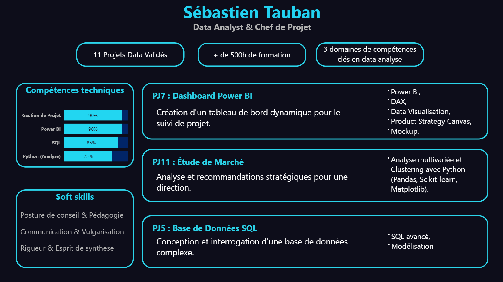
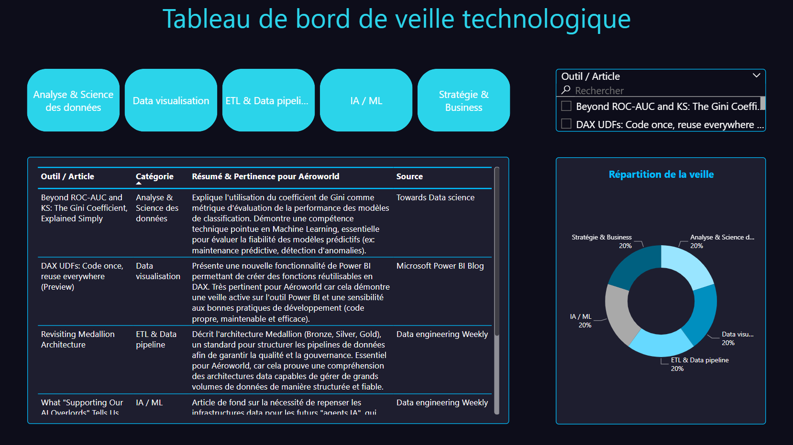

# Sébastien Tauban
## Data Analyst & Chef de Projet

---

## Présentation
Fort d'une solide expérience en gouvernance, gestion des risques et contrôle interne dans des environnements complexes et exigeants, j'ai orienté ma carrière vers l'analyse de données, convaincu que la maîtrise de la data est la clé pour piloter la performance et la conformité.

Actuellement en formation de Data Analyst chez OpenClassRooms, je mets aujourd'hui mes compétences en SQL, Python et Power BI au service de la transformation de données brutes en informations stratégiques. Ce portfolio, conçu pour Aéroworld, démontre à travers des livrables concrets ma capacité à allier rigueur analytique et posture de conseil pour répondre à vos enjeux.

---

## Démonstration des Compétences

#### Tableaux de Bord d'Analyse

Voici un aperçu des deux dashboards réalisés pour ce projet :

**Dashboard 1 : Profil & Compétences**
*Cet aperçu montre une synthèse de mon profil technique et de mes projets clés.*

  
**Dashboard 2 : Veille Technologique**
*Ce dashboard fonctionnel permet de suivre et filtrer les dernières tendances du monde de la data.*

 

**Pour une expérience interactive :**

➡️ **[Télécharger le rapport interactif](Dashboard.pbix)**

> **Note :** Pour un affichage optimal des couleurs et du thème, merci d'importer le fichier de thème fourni. Dans Power BI, allez dans **Affichage > Thèmes > Parcourir les thèmes** et sélectionnez le fichier `theme_portfolio.json`.

## Compétences

La présentation suivante sert de base au cadrage de ce portfolio.  

 

Ce cahier des charges formalise la traduction du besoin en spécifications fonctionnelles avec les objectifs et les livrables du projet.  

 

Pour assurer la pérennité et la prise en main de l'outil et ainsi démontrer ma capacité à former les utilisateurs, j’ai réalisé une courte vidéo de présentation du dashboard de veille  et une documentation pour l'utilisation et la mise à jour du dashboard . 

 

## Gestion du projet Portfolio

Ci-dessous, le diagramme de Gantt qui a permis la planification pour la réalisation du portfolio.  

---

## Me contacter

&nbsp;&nbsp;&nbsp;&nbsp;
